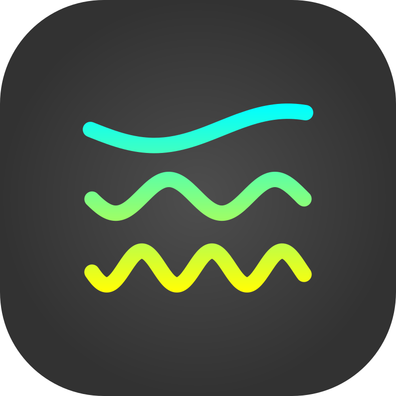
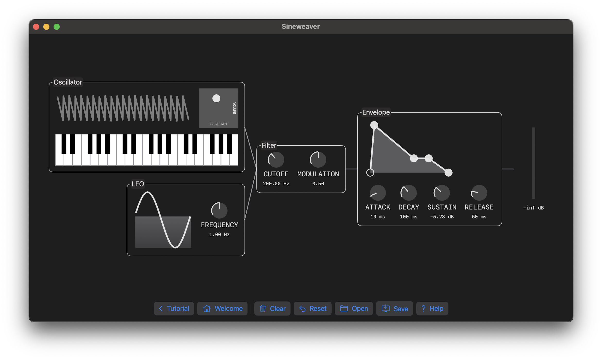

# Sineweaver

A modular synthesizer featuring an interactive introduction.

## Open Source

The project includes source code from my own MIT-licensed libraries [`swift-music-theory`](https://github.com/fwcd/swift-music-theory) and [`swift-utils`](https://github.com/fwcd/swift-utils).
